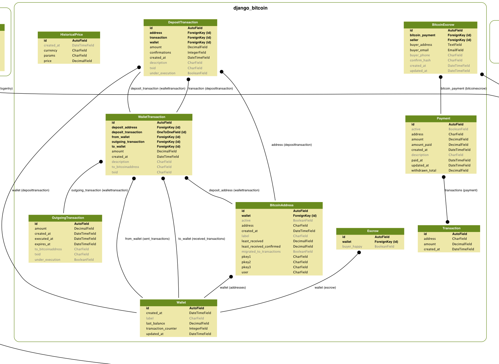

# bitcoin-zoo

## How to Install

```sh
sudo apt-get update
sudo apt-get install build-essential python-dev libmysqlclient-dev
sudo pip install -r requirements.txt
python manage.py  schemamigration django_bitcoin --initial
python manage.py syncdb
python manage.py migrate
python manage.py  runserver_plus 0.0.0.0:8000
python manage.py check_permissions
# this line is for userena bug
# Permission matching query does not exist
[open http://127.0.0.1:8000/docs/](http://127.0.0.1:8000/docs/)
```

## How to run celery tasks

go into the bitcoin-zoo directory
just enter the command :)

```
celery worker -A core -B --loglevel=INFO

```

## How to Debug Celery

```
modify /bitcoin-zoo/core/celeryconfig.py 
CELERY_ALWAYS_EAGER = True

```
## How to Run Testing Case

```
python manage.py test
or 
Use PyDev Django Unit Testing

```

## bitcoin zoo er digram
